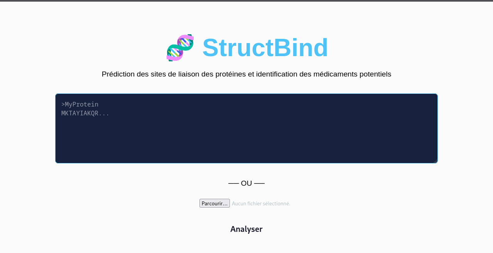
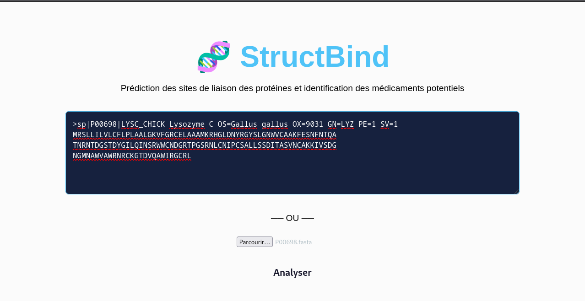
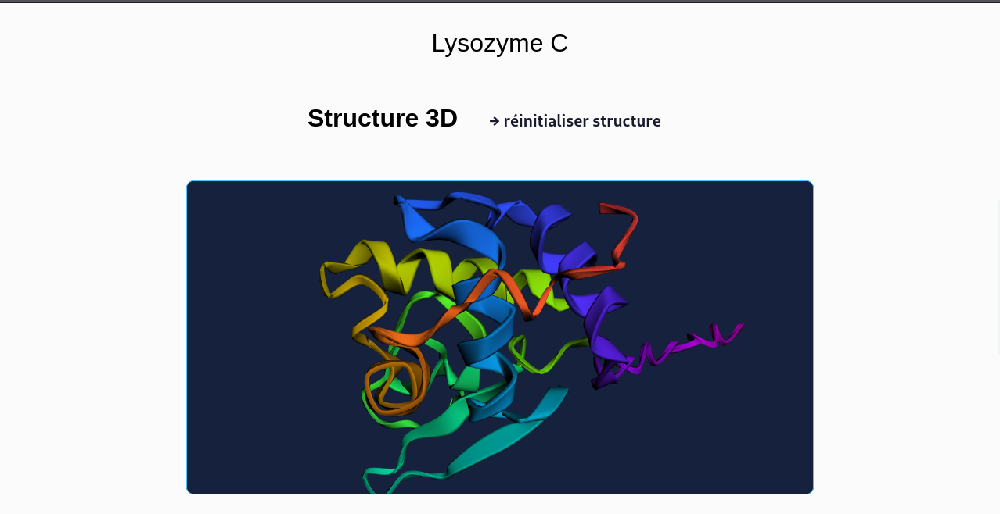
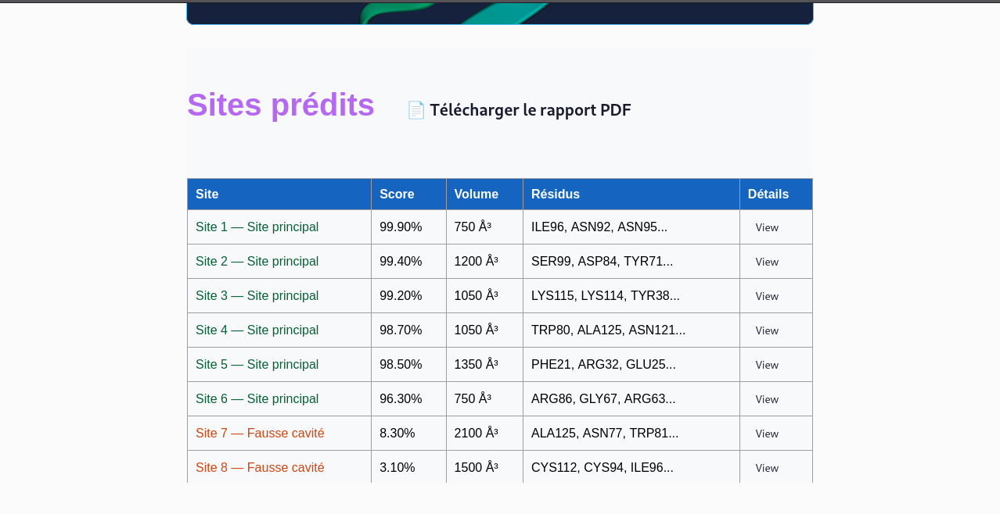

# StructBind 🧬

Application web de prédiction de structures protéiques et de détection de sites de liaison, développée avec React et FastAPI.

👉 [Accéder à StructBind](https://structbind.vercel.app)

## Fonctionnalités

- **Prédiction de structure 3D** : modélisation de la structure protéique via ESMFold
- **Détection de sites de liaison** : identification des poches potentielles avec fpocket
- **Visualisation 3D interactive** : exploration de la structure dans le navigateur avec 3Dmol.js
- **Score de druggabilité** : évaluation du potentiel thérapeutique des sites détectés (XGBoost)

## Stack technique

| Composant | Technologie |
|-----------|-------------|
| Frontend | React (Create React App), 3Dmol.js |
| Backend | FastAPI, Python |
| Prédiction de structure | ESMFold |
| Détection de poches | fpocket |
| Classification | XGBoost |
| Déploiement frontend | Vercel |
| Déploiement backend | Render |

## Utilisation


1. Entrez ou collez une séquence protéique au format FASTA ou en acides aminés bruts
    
2. Cliquez sur **Analyser**
3. Visualisez la structure 3D prédite et les sites de liaison détectés
    
4. Consultez les scores de druggabilité pour chaque site 
    

## Déploiement local

### Créer un environnement virtuel
```bash
python3 -m venv venv
source venv/bin/activate
```

### Installer les dépendances
```bash
pip install -r requirements.txt
```

### Installer fpocket
```bash
sudo apt install fpocket
```

### Backend

```bash
cd backend
pip install -r requirements.txt
uvicorn main:app --reload
```

### Frontend

```bash
cd frontend
npm install
npm start
```

> Le frontend est configuré pour appeler `https://structbind.onrender.com` par défaut.  
> Pour pointer vers le backend local, créez un fichier `.env` dans `frontend/` :
> ```
> REACT_APP_API_URL=http://localhost:8000
> ```

## Auteure

**Myriam Feumi étudiante en informatique**